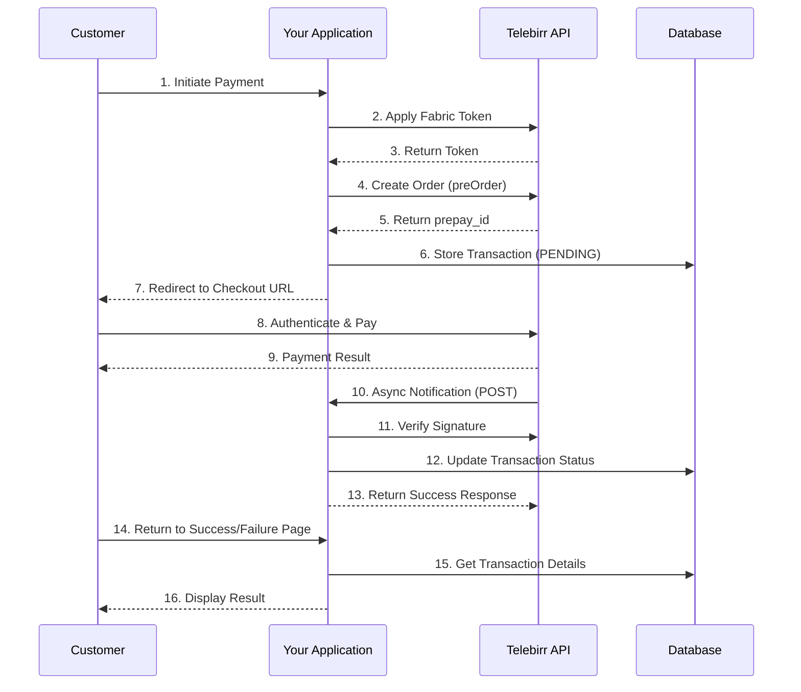

# 🇪🇹 Telebirr C2B Web Payment Integration for PHP

[](https://php.net)
[](LICENSE)
[](https://github.com/MIKEINTOSHSYSTEMS/telebirr-php-payment-integration/stargazers)
[](https://github.com/MIKEINTOSHSYSTEMS/telebirr-php-payment-integration/issues)
[](https://github.com/MIKEINTOSHSYSTEMS/telebirr-php-payment-integration/releases)

A complete, production-ready Telebirr C2B (Customer to Business) web payment integration solution for PHP applications. This library provides seamless integration with Ethio Telecom's Telebirr payment gateway, supporting one-time payments, order queries, refunds, and webhook notifications with enterprise-grade security and comprehensive logging.

## 📋 Table of Contents

- [Features](#-features)
- [System Requirements](#-system-requirements)
- [Data Flow & Architecture](#-data-flow--architecture)
- [Installation](#-installation)
- [Configuration](#-configuration)
- [Usage Examples](#-usage-examples)
- [API Endpoints](#-api-endpoints)
- [Database Schema](#-database-schema)
- [Integration with Moodle](#-integration-with-moodle)
- [Security](#-security)
- [Logging & Monitoring](#-logging--monitoring)
- [Testing](#-testing)
- [Troubleshooting](#-troubleshooting)
- [Production Checklist](#-production-checklist)
- [Contributing](#-contributing)
- [License](#-license)
- [Support](#-support)

## ✨ Features

- ✅ **Complete C2B Payment Flow** - Initiate, query, and refund payments
- ✅ **Fabric Token Management** - Automatic token caching and refresh
- ✅ **RSA Signing & Verification** - Secure SHA256withRSA signatures
- ✅ **Dark/Light Mode UI** - Modern, responsive interface with theme toggle
- ✅ **Database Logging** - Automatic logging of all API calls to database
- ✅ **File Logging** - Comprehensive logging with Monolog
- ✅ **Comprehensive Logs Viewer** - Filter, search, and export API logs
- ✅ **Moodle Plugin Ready** - Can be easily integrated as a Moodle payment plugin
- ✅ **H5 Mobile Optimized** - Responsive design for all devices
- ✅ **Production Ready** - Enterprise-grade error handling and security
- ✅ **Developer Friendly** - Clean, well-documented code with examples
- ✅ **PSR-4 Autoloading** - Follows PHP-FIG standards

## 💻 System Requirements

- PHP 7.4 or higher (8.0, 8.1, 8.2 supported)
- MySQL 5.7 or higher / MariaDB 10.2+
- Composer 2.0+
- Web Server (Apache/Nginx)
- OpenSSL extension
- cURL extension
- JSON extension
- PDO PHP extension
- SSL certificate for production

## 📊 Data Flow & Architecture

### High-Level Architecture

```

┌─────────────────┐     ┌──────────────────┐     ┌─────────────────┐
│                 │     │                  │     │                 │
│   Your App      │────▶│  Telebirr PHP    │────▶│   Telebirr      │
│   (Moodle/      │     │  Integration     │     │   API Gateway   │
│   Custom)       │◀────│  Library         │◀────│                 │
│                 │     │                  │     │                 │
└─────────────────┘     └──────────────────┘     └─────────────────┘
         │                       │                         │
         │                       │                         │
         ▼                       ▼                         ▼
┌─────────────────┐     ┌──────────────────┐     ┌─────────────────┐
│   Database      │     │   Log Files      │     │   Customer      │
│   (MySQL)       │     │   (Monolog)      │     │   (Browser)     │
└─────────────────┘     └──────────────────┘     └─────────────────┘

```

### Complete Payment Flow Diagram

```

┌──────────────┐     ┌──────────────┐     ┌──────────────┐     ┌──────────────┐
│   Customer   │     │   Your App   │     │   Telebirr   │     │   Database   │
│   (Browser)  │     │              │     │    Gateway   │     │              │
└──────┬───────┘     └──────┬───────┘     └──────┬───────┘     └──────┬───────┘
       │                    │                     │                    │
       │ 1. Click Pay       │                     │                    │
       │───────────────────>│                     │                    │
       │                    │                     │                    │
       │                    │ 2. Request Token    │                    │
       │                    │────────────────────>│                    │
       │                    │                     │                    │
       │                    │ 3. Return Token     │                    │
       │                    │<────────────────────│                    │
       │                    │                     │                    │
       │                    │ 4. Create Order     │                    │
       │                    │────────────────────>│                    │
       │                    │                     │                    │
       │                    │ 5. Return PrepayId  │                    │
       │                    │<────────────────────│                    │
       │                    │                     │                    │
       │                    │ 6. Store Transaction│                    │
       │                    │─────────────────────────────────────────>│
       │                    │                     │                    │
       │ 7. Redirect to     │                     │                    │
       │<───────────────────│                     │                    │
       │                    │                     │                    │
       │ 8. Customer        │                     │                    │
       │    authenticates   │                     │                    │
       │─────────────────────────────────────────>│                    │
       │                    │                     │                    │
       │ 9. Payment         │                     │                    │
       │    processed       │                     │                    │
       │<─────────────────────────────────────────│                    │
       │                    │                     │                    │
       │ 10. Async          │                     │                    │
       │    Notification    │                     │                    │
       │                    │<────────────────────│                    │
       │                    │                     │                    │
       │                    │ 11. Update          │                    │
       │                    │    Transaction      │                    │
       │                    │─────────────────────────────────────────>│
       │                    │                     │                    │
       │ 12. Redirect to    │                     │                    │
       │    Success/Failure │                     │                    │
       │<───────────────────│                     │                    │
       │                    │                     │                    │

```

### Sequence Diagram



### Component Interaction Diagram

```
┌─────────────────────────────────────────────────────────────────┐
│                      TelebirrPayment (Facade)                    │
│  ┌─────────────┐  ┌─────────────┐  ┌─────────────┐  ┌─────────┐ │
│  │ApplyFabric- │  │ CreateOrder │  │ QueryOrder  │  │Refund-  │ │
│  │Token        │  │             │  │             │  │Order    │ │
│  └─────────────┘  └─────────────┘  └─────────────┘  └─────────┘ │
│  ┌─────────────┐  ┌─────────────┐  ┌─────────────┐  ┌─────────┐ │
│  │NotifyHandler│  │   Signer    │  │Signature-   │  │ApiLogger│ │
│  │             │  │             │  │Verifier     │  │         │ │
│  └─────────────┘  └─────────────┘  └─────────────┘  └─────────┘ │
└─────────────────────────────────────────────────────────────────┘
                              │
                              ▼
┌─────────────────────────────────────────────────────────────────┐
│                       External Systems                            │
│  ┌─────────────────┐  ┌─────────────────┐  ┌─────────────────┐  │
│  │   Telebirr API  │  │    Database     │  │   Log Files     │  │
│  │   (HTTPS)       │  │    (MySQL)      │  │   (Monolog)     │  │
│  └─────────────────┘  └─────────────────┘  └─────────────────┘  │
└─────────────────────────────────────────────────────────────────┘
```

## 🚀 Installation

### 1. Clone the Repository

```bash
git clone https://github.com/MIKEINTOSHSYSTEMS/telebirr-php-payment-integration.git
cd telebirr-php-payment-integration
```

### 2. Install Dependencies

```bash
composer install
```

### 3. Configure Environment

```bash
cp .env.example .env
# Edit .env with your credentials
```

### 4. Set Up Database

```bash
# Import the database schema
mysql -u username -p database_name < config/db.sql
```

### 5. Add RSA Keys

Place your private and public keys in `config/keys/`:

- `private_key.pem` - Your private key (keep secure, 644 permissions)
- `public_key.pem` - Your public key (share with Telebirr)

### 6. Set Permissions

```bash
chmod 755 logs/
chmod 644 config/keys/*.pem
chmod 644 .env
```

## 🔧 Configuration

### Environment Variables (.env)

| Variable | Description | Example | Required |
|----------|-------------|---------|----------|
| `BASE_URL` | API base URL (test/production) | `https://developerportal.ethiotelebirr.et:38443/apiaccess/payment/gateway` | Yes |
| `WEB_BASE_URL` | Web checkout base URL | `https://developerportal.ethiotelebirr.et:38443/payment/web/paygate?` | Yes |
| `FABRIC_APP_ID` | Your fabric app ID | `c4182ef8-9249-458a-985e-06d191f4d505` | Yes |
| `APP_SECRET` | Your app secret | `fad0f06383c6297f545876694b974599` | Yes |
| `MERCHANT_APP_ID` | Your merchant app ID | `1579902121088002` | Yes |
| `MERCHANT_CODE` | Your merchant short code | `703600` | Yes |
| `DEBUG_MODE` | Enable/disable debug mode | `true` or `false` | Yes |
| `NOTIFY_URL` | Webhook notification URL | `https://your-domain.com/checkout.php` | Yes |
| `REDIRECT_URL` | Success redirect URL | `https://your-domain.com/payment-success.php` | Yes |
| `FAILURE_URL` | Failure redirect URL | `https://your-domain.com/payment-failed.php` | Yes |
| `DB_HOST` | Database host | `localhost` | No |
| `DB_NAME` | Database name | `telebirr_payments` | No |
| `DB_USER` | Database user | `root` | No |
| `DB_PASS` | Database password | `********` | No |
| `LOG_LEVEL` | Logging level | `DEBUG`, `INFO`, `ERROR` | Yes |
| `LOG_RETENTION_DAYS` | Days to keep logs | `30` | No |

### Payment Configuration (config/config.php)

```php
return [
    'payment' => [
        'currency' => 'ETB',
        'timeout_express' => '120m',
        'business_type' => 'BuyGoods',
        'trade_type' => 'Checkout',
        'version' => '1.0',
        'sign_type' => 'SHA256WithRSA',
        'payee_identifier_type' => '04',
        'payee_type' => '5000',
    ],
    // ... other config
];
```

## 📝 Usage Examples

### Initialize Payment

```php
<?php
require_once 'vendor/autoload.php';

use Telebirr\TelebirrPayment;

// Load configuration
$config = require 'config/config.php';

// Initialize payment gateway
$telebirr = new TelebirrPayment($config);

// Initialize payment
$result = $telebirr->initializePayment(
    'Premium Course Access',           // Product title
    1500.00,                           // Amount in ETB
    [
        'customer_name' => 'Abebech Kebede',
        'customer_phone' => '0912345678',
        'customer_email' => 'abebech.k@example.com',
        'description' => 'Premium Course - Web Development'
    ]
);

if ($result['success']) {
    // Store order ID for later reference
    $_SESSION['last_order_id'] = $result['merch_order_id'];
    
    // Redirect to Telebirr checkout
    header('Location: ' . $result['checkout_url']);
    exit;
} else {
    // Handle error
    error_log("Payment failed: " . $result['error']);
    echo "Error: " . $result['error'];
}
```

### Query Payment Status

```php
<?php
$orderId = $_GET['order_id'] ?? '17714632549580';
$result = $telebirr->queryPayment($orderId);

if ($result['success']) {
    $data = $result['data'];
    echo "Order ID: " . $data['merch_order_id'] . "\n";
    echo "Status: " . $data['order_status'] . "\n";
    echo "Amount: " . $data['total_amount'] . " ETB\n";
    echo "Transaction Time: " . $data['trans_time'] . "\n";
} else {
    echo "Query failed: " . $result['error'];
}
```

### Process Refund

```php
<?php
$result = $telebirr->refundPayment(
    '17714632549580',    // Original order ID
    500.00,              // Refund amount
    'Customer requested refund due to service issue' // Reason
);

if ($result['success']) {
    echo "✅ Refund initiated successfully!\n";
    echo "Refund Request No: " . $result['refund_request_no'] . "\n";
    print_r($result['data']);
} else {
    echo "❌ Refund failed: " . $result['error'];
}
```

### Handle Webhook Notification

```php
<?php
// In your notify_url endpoint (checkout.php)
$result = $telebirr->handleNotification($_POST);

// Set HTTP response code
http_response_code($result['http_code']);

// Return response
header('Content-Type: application/json');
echo json_encode(['status' => $result['success'] ? 'success' : 'error']);
```

### Get Transaction from Database

```php
<?php
$transaction = $telebirr->getTransaction('17714632549580');
if ($transaction) {
    echo "Order: " . $transaction['merch_order_id'] . "\n";
    echo "Status: " . $transaction['status'] . "\n";
    echo "Amount: " . $transaction['amount'] . " ETB\n";
    echo "Date: " . $transaction['created_at'] . "\n";
}
```

### Get Recent Transactions

```php
<?php
$transactions = $telebirr->getTransactions(1, 10); // Page 1, 10 per page

if ($transactions['success']) {
    foreach ($transactions['data'] as $tx) {
        echo "{$tx['merch_order_id']} - {$tx['amount']} ETB - {$tx['status']}\n";
    }
    
    echo "Page {$transactions['pagination']['current_page']} of {$transactions['pagination']['total_pages']}";
}
```

### View API Logs

```php
<?php
$logs = $telebirr->getApiLogs(1, 50, [
    'method' => 'POST',
    'status_code' => 200,
    'date_from' => '2026-02-01'
]);

if ($logs['success']) {
    foreach ($logs['data'] as $log) {
        echo "[{$log['created_at']}] {$log['method']} {$log['endpoint']} - {$log['status_code']}\n";
    }
}
```

## 🔌 API Endpoints

### Telebirr API Endpoints Used

| Endpoint | Method | Description | Called By |
|----------|--------|-------------|-----------|
| `/payment/v1/token` | `POST` | Get fabric token | `ApplyFabricToken` |
| `/payment/v1/merchant/preOrder` | `POST` | Create payment order | `CreateOrder` |
| `/payment/v1/merchant/queryOrder` | `POST` | Query order status | `QueryOrder` |
| `/payment/v1/merchant/refund` | `POST` | Process refund | `RefundOrder` |
| `/payment/web/paygate?` | `GET` | Checkout page | Customer browser |

### Your Application Endpoints

| Endpoint | Purpose | Handled By |
|----------|---------|------------|
| `/public/demo.php` | Payment form | `TelebirrPayment::initializePayment()` |
| `/public/checkout.php` | Webhook receiver | `NotifyHandler::handleNotification()` |
| `/public/payment-success.php` | Success page | `TelebirrPayment::getTransaction()` |
| `/public/payment-failed.php` | Failure page | `TelebirrPayment::getTransaction()` |
| `/public/query-order.php` | Order query | `TelebirrPayment::queryPayment()` |
| `/public/refund-order.php` | Refund form | `TelebirrPayment::refundPayment()` |
| `/public/logs.php` | Log viewer | `TelebirrPayment::getApiLogs()` |
| `/public/export-logs.php` | Log export | CSV generation |

## 📁 Database Schema

### transactions table

```sql
CREATE TABLE transactions (
    id INT AUTO_INCREMENT PRIMARY KEY,
    merch_order_id VARCHAR(64) NOT NULL UNIQUE,
    payment_order_id VARCHAR(64),
    trans_id VARCHAR(64),
    appid VARCHAR(32),
    merch_code VARCHAR(16),
    title VARCHAR(512),
    amount DECIMAL(20,2),
    currency VARCHAR(3) DEFAULT 'ETB',
    status VARCHAR(20) DEFAULT 'PENDING',
    trade_status VARCHAR(20),
    prepay_id VARCHAR(128),
    notify_data TEXT,
    customer_phone VARCHAR(20),
    payment_method VARCHAR(50),
    created_at TIMESTAMP DEFAULT CURRENT_TIMESTAMP,
    updated_at TIMESTAMP DEFAULT CURRENT_TIMESTAMP ON UPDATE CURRENT_TIMESTAMP,
    completed_at TIMESTAMP NULL,
    INDEX idx_merch_order (merch_order_id),
    INDEX idx_payment_order (payment_order_id),
    INDEX idx_status (status),
    INDEX idx_created (created_at)
) ENGINE=InnoDB DEFAULT CHARSET=utf8mb4;
```

### refunds table

```sql
CREATE TABLE refunds (
    id INT AUTO_INCREMENT PRIMARY KEY,
    refund_request_no VARCHAR(64) NOT NULL UNIQUE,
    transaction_id INT,
    merch_order_id VARCHAR(64),
    payment_order_id VARCHAR(64),
    trans_order_id VARCHAR(64),
    refund_order_id VARCHAR(64),
    amount DECIMAL(20,2),
    currency VARCHAR(3) DEFAULT 'ETB',
    reason TEXT,
    status VARCHAR(20) DEFAULT 'PENDING',
    refund_data TEXT,
    created_at TIMESTAMP DEFAULT CURRENT_TIMESTAMP,
    completed_at TIMESTAMP NULL,
    FOREIGN KEY (transaction_id) REFERENCES transactions(id),
    INDEX idx_refund_request (refund_request_no)
) ENGINE=InnoDB DEFAULT CHARSET=utf8mb4;
```

### api_logs table

```sql
CREATE TABLE api_logs (
    id INT AUTO_INCREMENT PRIMARY KEY,
    endpoint VARCHAR(255),
    method VARCHAR(10),
    request_data TEXT,
    response_data TEXT,
    status_code INT,
    ip_address VARCHAR(45),
    user_agent TEXT,
    created_at TIMESTAMP DEFAULT CURRENT_TIMESTAMP,
    INDEX idx_endpoint (endpoint),
    INDEX idx_status_code (status_code),
    INDEX idx_created (created_at)
) ENGINE=InnoDB DEFAULT CHARSET=utf8mb4;
```

## 🎓 Integration with Moodle

### Step-by-Step Moodle Plugin Integration

1. **Create Plugin Structure**

```bash
cd /path/to/moodle
mkdir -p payment/gateway/telebirr
cd payment/gateway/telebirr
```

1. **Copy Core Classes**

```bash
cp -r /path/to/telebirr-php/src/* payment/gateway/telebirr/classes/
```

1. **Create Moodle Plugin Files**

**version.php**

```php
<?php
$plugin->component = 'paymentgateway_telebirr';
$plugin->version = 2026022000;
$plugin->requires = 2020061500;
$plugin->maturity = MATURITY_STABLE;
$plugin->release = '1.0.0';
```

**lib.php**

```php
<?php
function paymentgateway_telebirr_payment_method_list() {
    return ['telebirr'];
}

function paymentgateway_telebirr_payment_method_config($method) {
    return [
        'base_url' => get_config('paymentgateway_telebirr', 'base_url'),
        'fabric_app_id' => get_config('paymentgateway_telebirr', 'fabric_app_id'),
        // ... other config
    ];
}
```

**gateway.php**

```php
<?php
namespace paymentgateway_telebirr;

use Telebirr\TelebirrPayment;

class gateway extends \core_payment\gateway {
    public function execute_payment($paymentid, $userid, $amount, $currency) {
        global $CFG;
        
        require_once $CFG->dirroot . '/payment/gateway/telebirr/classes/TelebirrPayment.php';
        
        $config = $this->get_config();
        $telebirr = new TelebirrPayment($config);
        
        $result = $telebirr->initializePayment(
            'Moodle Course Enrollment',
            $amount,
            ['userid' => $userid]
        );
        
        if ($result['success']) {
            redirect($result['checkout_url']);
        } else {
            throw new \moodle_exception('paymentfailed', 'paymentgateway_telebirr');
        }
    }
}
```

**settings.php**

```php
<?php
if ($hassiteconfig) {
    $settings = new admin_settingpage('paymentgateway_telebirr', 'Telebirr Settings');
    
    $settings->add(new admin_setting_configtext(
        'paymentgateway_telebirr/base_url',
        'API Base URL',
        'Telebirr API endpoint',
        'https://developerportal.ethiotelebirr.et:38443/apiaccess/payment/gateway',
        PARAM_URL
    ));
    
    $settings->add(new admin_setting_configtext(
        'paymentgateway_telebirr/fabric_app_id',
        'Fabric App ID',
        'Your fabric application ID',
        '',
        PARAM_TEXT
    ));
    
    // ... other settings
}
```

## 🔒 Security

### Key Security Features

1. **RSA-SHA256 Signatures**
   - All requests signed with private key
   - All notifications verified with public key
   - Prevents tampering and forgery

2. **Environment Isolation**
   - Separate test/production credentials
   - Environment variables for sensitive data
   - No hardcoded credentials

3. **Database Security**
   - PDO prepared statements prevent SQL injection
   - Password hashing for stored data
   - Encrypted sensitive information

4. **XSS Protection**
   - HTML escaping for all output
   - Content Security Policy headers
   - Input validation and sanitization

5. **CSRF Protection**
   - Session-based tokens for forms
   - Origin validation for webhooks
   - SameSite cookie attributes

### Security Headers (.htaccess)

```apache
<IfModule mod_headers.c>
    Header set X-Content-Type-Options "nosniff"
    Header set X-Frame-Options "SAMEORIGIN"
    Header set X-XSS-Protection "1; mode=block"
    Header set Referrer-Policy "strict-origin-when-cross-origin"
    Header set Content-Security-Policy "default-src 'self'"
</IfModule>
```

## 📊 Logging & Monitoring

### Log Levels

| Level | Description | Example |
|-------|-------------|---------|
| `DEBUG` | Detailed debugging info | Request/response payloads |
| `INFO` | Normal operations | Payment initialized, token obtained |
| `WARNING` | Non-critical issues | Retry attempts, slow responses |
| `ERROR` | Critical errors | API failures, signature mismatches |

### Log Files

- `logs/payment.log` - Main application log
- `logs/error.log` - Error-specific log
- Database `api_logs` table - Structured API call logs

### Logs Viewer

Access the comprehensive logs viewer at `/public/logs.php` with features:

- Filter by endpoint, method, status code
- Date range filtering
- Search in request/response data
- JSON syntax highlighting
- CSV export
- Pagination
- Statistics dashboard

### Log Cleanup

```bash
# Manual cleanup
php public/maintenance/clean-logs.php

# Automated via cron (daily at midnight)
0 0 * * * /usr/bin/php /path/to/project/public/maintenance/clean-logs.php
```

## 🧪 Testing

### Test Credentials (Sandbox)

```
FABRIC_APP_ID=c4182ef8-9249-458a-985e-06d191f4d505
APP_SECRET=fad0f06383c6297f545876694b974599
MERCHANT_APP_ID=1579902121088002
MERCHANT_CODE=703600
BASE_URL=https://developerportal.ethiotelebirr.et:38443/apiaccess/payment/gateway
WEB_BASE_URL=https://developerportal.ethiotelebirr.et:38443/payment/web/paygate?
```

### Test Scenarios

1. **Successful Payment**
   - Amount: Any amount > 0.01
   - Complete payment on Telebirr
   - Should redirect to success page

2. **Failed Payment**
   - Amount: 0.01
   - Cancel on Telebirr or enter wrong PIN
   - Should redirect to failure page

3. **Timeout**
   - Initiate payment but don't complete
   - Wait 120 minutes
   - Status should show as expired

4. **Refund**
   - Complete a payment first
   - Process refund for partial/full amount
   - Check refund status

### Unit Tests

```bash
# Run tests
vendor/bin/phpunit tests/

# Test specific class
vendor/bin/phpunit tests/ApplyFabricTokenTest.php
```

## 🔍 Troubleshooting

### Common Issues and Solutions

| Issue | Possible Cause | Solution |
|-------|---------------|----------|
| `"Invalid signature"` | Wrong key format | Check private key format (PKCS#8) |
| `"Token expired"` | Session/cache issue | Clear session, check time sync |
| `"Order not found"` | Wrong order ID format | Use numeric only (no hyphens) |
| `"cURL error 60"` | SSL certificate issue | Update CA certificates |
| `"Database not connected"` | Wrong credentials | Check .env database settings |
| `"API call not logged"` | Missing `duration` column | Run database update script |

### Debug Mode

Enable debug mode in `.env`:

```env
DEBUG_MODE=true
LOG_LEVEL=DEBUG
```

Access diagnostic tools:

- `/public/test-autoload.php` - Check autoloader
- `/public/test-token.php` - Test token generation
- `/public/diagnostic.php` - Full system diagnostic

## ✅ Production Checklist

- [ ] Update `.env` with production credentials
- [ ] Set `DEBUG_MODE=false`
- [ ] Enable SSL verification (`verify_ssl=true` in config)
- [ ] Configure proper web server (Apache/Nginx)
- [ ] Set up database backups (daily)
- [ ] Configure monitoring and alerts
- [ ] Test complete payment flow
- [ ] Verify webhook endpoints are publicly accessible
- [ ] Set up error reporting (Sentry, etc.)
- [ ] Configure proper file permissions
- [ ] Enable HTTPS with valid SSL certificate
- [ ] Set up log rotation (logrotate)
- [ ] Configure firewall rules
- [ ] Set up rate limiting
- [ ] Test refund process
- [ ] Verify email notifications

## 🤝 Contributing

Contributions are welcome! Please read our [Contributing Guidelines](CONTRIBUTING.md) first.

1. Fork the repository
2. Create your feature branch (`git checkout -b feature/amazing-feature`)
3. Commit your changes (`git commit -m 'Add some amazing feature'`)
4. Push to the branch (`git push origin feature/amazing-feature`)
5. Open a Pull Request

### Development Setup

```bash
git clone https://github.com/MIKEINTOSHSYSTEMS/telebirr-php-payment-integration.git
cd telebirr-php-payment-integration
composer install
cp .env.example .env
# Edit .env with test credentials
```

## 📄 License

This project is licensed under the MIT License - see the [LICENSE](LICENSE) file for details.

```
MIT License

Copyright (c) 2026 MIKEINTOSH SYSTEMS

Permission is hereby granted, free of charge, to any person obtaining a copy
of this software and associated documentation files...
```

## 👨‍💻 Author

**Michael Kifle Teferra**

- Website: [https://mikeintoshs.com](https://mikeintoshs.com)
- Email: [mikeintoshsys@gmail.com](mailto:mikeintoshsys@gmail.com)
- GitHub: [@MIKEINTOSHSYSTEMS](https://github.com/MIKEINTOSHSYSTEMS)
- LinkedIn: [Michael Kifle](https://linkedin.com/in/michael-kifle)

## 🙏 Acknowledgments

- **Ethio Telecom** - For providing the Telebirr API
- **PHP Community** - For excellent libraries and tools
- **Moodle Community** - For the plugin architecture
- **All Contributors** - Who helped test and improve this library

## 📚 Additional Resources

- [Official Telebirr Documentation](https://developer.ethiotelecom.et/docs/category/h5-c2b-web-payment-integration)
- [PHP-FIG Standards](https://www.php-fig.org)
- [Monolog Documentation](https://seldaek.github.io/monolog)
- [phpseclib Documentation](https://phpseclib.com)

## 📊 Version History

See [CHANGELOG.md](CHANGELOG.md) for details.

## 📞 Support

For support and questions:

1. 📧 Email: [mikeintoshsys@gmail.com](mailto:mikeintoshsys@gmail.com)
2. 🐛 GitHub Issues: [https://github.com/MIKEINTOSHSYSTEMS/telebirr-php-payment-integration/issues](https://github.com/MIKEINTOSHSYSTEMS/telebirr-php-payment-integration/issues)
3. 📚 Documentation: [https://github.com/MIKEINTOSHSYSTEMS/telebirr-php-payment-integration/wiki](https://github.com/MIKEINTOSHSYSTEMS/telebirr-php-payment-integration/wiki)
4. 💬 Telegram: [https://t.me/mikeintosh](https://t.me/mikeintosh)
5. 📞 Phone: [+251913391985](+251913391985) / [+251938048182](+251938048182)

---

**Made with ❤️ in Ethiopia 🇪🇹 by MIKEINTOSH SYSTEMS**

*Empowering Ethiopian businesses with seamless digital payments*
